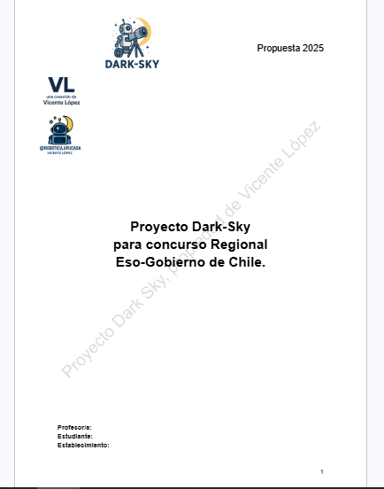
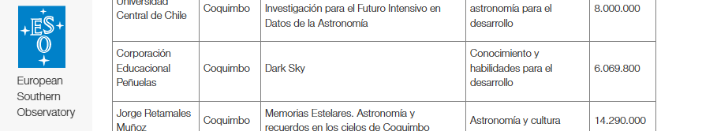

# Dark-Sky-Educational-Project / Proyecto-Educacional-Dark-Sky

## Description / Descripción
- This project consists of implementing an astronomy and robotics academy in my school through funding from the "ESO-Chile Government Regional Joint Committee," with the goal of developing critical-scientific thinking, scientific curiosity, and the proper use of technology.
- Este proyecto consiste en implementar una academia de astronomía y robótica en mi colegio mediante los fondos del "comité mixto regional ESO-Gobierno de Chile" con el objetivo de desarrollar el pensamiento crítico-científico, el instinto científico y el buen uso de la tecnología.

## Images / Imágenes

## Objectives / Objetivos
- Empower students in the field of science.
- Develop critical thinking.
- Encourage technological and scientific development within the educational community.
- Potenciar a los estudiantes en el área de las ciencias.
- Desarrollar el pensamiento crítico.
- Incentivar el desarrollo tecnológico y científico en la comunidad educativa.

## Funds / Fondos
- Funding from the ESO-Chile Government Regional Joint Committee.
- The funds will be used for hiring teachers, purchasing Arduino kits, and organizing educational field trips.
- Fondos del comité mixto regional ESO-Gobierno de Chile.
- Los fondos serán usados para contratación de docentes, compra de kits de Arduino y salidas pedagógicas.

## At the Time / Actualmente
- I am currently working with my school to implement this academy, including student enrollment, material acquisition, planning, teacher recruitment, etc.
- Actualmente trabajo junto con mi colegio para implementar esta academia: inscripción de estudiantes, compra de materiales, planificación, búsqueda de docentes, etc.

## Links
- Winners / Ganadores: https://www.eso.org/public/chile/announcements/annlocal26001-es-cl/